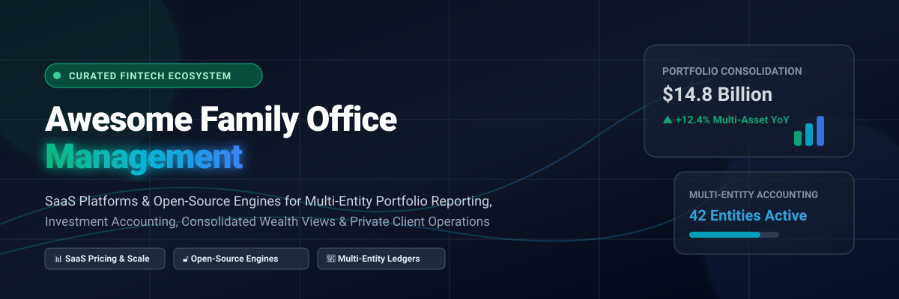

  

  
  
  
  
  
  
  

---

# 🏛️ Awesome Family Office Management Ecosystem

> **A curated showcase of commercial SaaS platforms and open-source software for Single Family Offices (SFOs), Multi-Family Offices (MFOs), Wealth Managers, and Private Client Operations.**

This repository tracks notable **SaaS platforms** and **open-source projects** designed for **Family Office Management**. These technology solutions empower wealth managers and principals to aggregate liquid and private market assets, produce multi-entity consolidated reporting, streamline investment accounting, manage trusts/LLCs, and deliver principal-ready wealth dashboards.

---

## 📌 Table of Contents

- [📊 Sector Market Analysis](#-sector-market-analysis)
- [🏢 SaaS & Hosted Platforms](#-saas--hosted-platforms)
- [🔓 Open-Source GitHub Projects](#-open-source-github-projects)
- [💡 Open-Source Implementation Playbook](#-open-source-implementation-playbook)
- [🤝 How to Contribute](#-how-to-contribute)
- [📈 Star History](#-star-history)
- [💖 Support & Community](#-support--community)
- [⚠️ Disclaimer](#%EF%B8%8F-disclaimer)

---

## 📊 Sector Market Analysis

📊 **Sector Market Analysis**: The global Family Office Management & Wealth Technology software market is valued at approximately **$3.8 Billion to $5.2 Billion** and is **moderately to highly fragmented**—characterized by specialized niche providers across general ledger accounting, family governance, custodian data aggregation, and private equity reporting rather than a single winner-take-all provider.

---

## 🏢 SaaS & Hosted Platforms

Below is a comparative breakdown of leading commercial family office management systems, sorted by **Company Valuation / Market Scale (Descending)**.

| 🏢 SaaS Platform | 💰 Company Size / Scale / Revenue | 💵 Starting Pricing | 🆓 Free Tier / Trial Limits | 🎯 Key Focus & Capabilities |
| :--- | :--- | :--- | :--- | :--- |
| **[Addepar](https://addepar.com/)** | **~$3.3 Billion Valuation** *(~$275M ARR, $9T+ Assets)* | **~$50,000 / year** *(Tiered by 0.008%–0.03% AUM)* | **No Free Plan** *(14-day client sandbox demo upon enterprise sales request)* | Institutional portfolio reporting, risk analytics, and multi-asset data aggregation for large SFOs/MFOs. |
| **[Archway Platform](https://www.archwayplatform.com/)** | **~$120 Million Acquisition** *($850B+ Assets tracked)* | **~$25,000 / year** *(Tiered by entity & asset volume)* | **No Free Plan** *(Personalized product walkthrough demo on request)* | Integrated partnership accounting, multi-entity general ledger, and multi-generational family reporting. |
| **[FundCount](https://www.fundcount.com/)** | **Enterprise Scale** *($150B+ Assets, ~$30M Est. Rev)* | **~$22,000 / year** *(Starting annual baseline plan)* | **No Free Plan** *(Custom Proof of Concept / sandbox evaluation for qualified leads)* | Portfolio, partnership, and general ledger accounting for complex multi-entity private wealth structures. |
| **[Asset Vantage](https://www.assetvantage.com/)** | **Global Enterprise** *($100B+ Assets reported)* | **~$15,000 / year** *(Tiered by entities & account count)* | **$99 Paid Sandbox Trial** *(14-day trial pre-loaded with sample family financial data)* | Fully integrated investment accounting & multi-asset wealth management engine ("Financial OS"). |
| **[Canopy](https://www.canopy.com/)** | **~$20M ARR Scale** *(Venture-backed fintech)* | **~$264 / year** *($22/user/month starting tier)* | **7-Day Free Trial** *(Full-featured 1-week account trial for new users)* | Consolidated portfolio visibility, secure document vault, client collaboration, and accounting workflow. |
| **[Private Wealth Systems](https://www.privatewealthsystems.com/)** | **Private Enterprise** *(Global UHNW provider)* | **~$18,000 / year** *(Based on connected financial accounts)* | **No Free Plan** *(Guided live sandbox demonstration for institution leads)* | Multi-asset, multi-currency portfolio processing, performance attribution, and principal reporting. |
| **[WealthHub Solutions](https://www.wealthhubsolutions.com/)** | **Private Enterprise** *(Fiduciary fintech provider)* | **~$15,000 / year** *(Tiered by trust volume & accounts)* | **Free Evaluation Tour** *(Self-guided online product evaluation tour & demo)* | Salesforce-integrated fiduciary management, trust administration, and workflow automation. |
| **[Trusted Family](https://www.trustedfamily.com/)** | **Enterprise Niche** *(200+ multi-generational families)* | **~$12,000 / year** *(Enterprise family portal plan)* | **No Free Plan** *(Custom guided demonstration for family boards)* | Secure family governance, board communication, and multi-generational secure vault storage. |
| **[Asora](https://www.asora.com/)** | **Mid-Market Scale** *(European & global family office tech)* | **~$10,800 / year** *($900/month billed annually)* | **No Free Plan** *(Interactive product demo & trial access upon request)* | Modern automated wealth reporting, private asset tracking, and principal wealth visibility. |
| **[SumIT](https://www.sumit.com/)** | **Regional Enterprise** *(Specialized family wealth engine)* | **~$8,000 / year** *(Starting institutional subscription)* | **No Free Plan** *(Product demonstration on request)* | Multi-entity accounting, bill payment processing, and consolidated wealth reporting. |

---

## 🔓 Open-Source GitHub Projects

Open-source options provide privacy-conscious single-family offices and wealth technologists with local data ownership, transparent calculation rules, and self-hosted security.

The repositories below are sorted by **GitHub Stars_Count (Descending)**.

| 📦 Repository | ⭐ GitHub_Stars | 🛡️ License | 🎯 Description & Key Strengths |
| :--- | :--- | :--- | :--- |
| **[odoo/odoo](https://github.com/odoo/odoo)** |  | LGPL-3.0 | Open-source enterprise resource planning engine suitable for multi-entity general ledgers, holding company accounting, and custom family office operational workflows. |
| **[maybe-finance/maybe](https://github.com/maybe-finance/maybe)** |  | AGPL-3.0 | Open-source OS for personal finance, net-worth tracking, asset allocation visualization, and local-first wealth aggregation. |
| **[frappe/erpnext](https://github.com/frappe/erpnext)** |  | GPL-3.0 | Full-featured open-source ERP offering multi-currency accounting, entity management, document vaults, and financial consolidation. |
| **[actualbudget/actual](https://github.com/actualbudget/actual)** |  | MIT | Privacy-first, local-first personal finance manager with sync capabilities and complete data ownership. |
| **[firefly-iii/firefly-iii](https://github.com/firefly-iii/firefly-iii)** |  | AGPL-3.0 | Self-hosted personal finance and net-worth management system with rule-based transaction automation and multi-account tracking. |
| **[ghostfolio/ghostfolio](https://github.com/ghostfolio/ghostfolio)** |  | AGPL-3.0 | Open-source wealth management dashboard for asset tracking, portfolio breakdown, target asset allocation, and privacy-first analytics. |
| **[portfolio-performance/portfolio](https://github.com/portfolio-performance/portfolio)** |  | Eclipse Public | Open-source desktop tool to calculate True Time-Weighted Rate of Return (TWROR) and Internal Rate of Return (IRR) across multi-asset portfolios. |
| **[rotki/rotki](https://github.com/rotki/rotki)** |  | AGPL-3.0 | Local-first portfolio tracking, investment accounting, and analytics engine respecting user privacy and data sovereignty. |
| **[AojdevStudio/Finance-Guru](https://github.com/AojdevStudio/Finance-Guru)** |  | MIT | Self-hosted family-office / personal-finance engine with typed calculators, private ledger, and specialist agents for portfolio risk analysis. |
| **[sudo-prog/FAMLY-Office](https://github.com/sudo-prog/FAMLY-Office)** |  | MIT | Local-first, high-security open wealth-management OS concept for family offices featuring asset registers, net-worth analytics, and zero-cloud architecture. |

---

## 💡 Open-Source Implementation Playbook

🔒 **Building a Custom Hybrid Family Office Stack**:
1. **Local Ledger & Data Vault**: Maintain sensitive legal documents, trusts, and general ledgers locally via open ERP software (*ERPNext*, *Odoo*, or *FAMLY-Office*).
2. **Public Data Feeds & Analytics**: Ingest liquid market prices via open portfolio trackers (*Ghostfolio*, *Portfolio Performance*, or *Rotki*).
3. **Net Worth & Principal Dashboards**: Produce consolidated net-worth and asset allocation views using privacy-focused local engines (*Maybe*, *Actual Budget*).
4. **Institutional Private Asset Analytics**: Utilize commercial platforms (*Addepar*, *Archway*, *FundCount*, *Asset Vantage*) when managing complex private equity capital calls, real estate partnerships, and institutional custodian feeds.

---

## 🤝 How to Contribute

Contributions are warmly welcomed! To suggest a new SaaS product or open-source tool:

1. Fork the repository.
2. Update `README.md` adhering to the table layout, Stars_Badges, and detailed pricing format.
3. Submit a Pull Request with a clear summary of your additions.

*Check out our list of awesome resources at [Awesome-Awesome-Awesome](https://github.com/ishandutta2007/Awesome-Awesome-Awesome).*

---

## 📈 Star History

---

## 💖 Support & Community

Thank you for exploring and supporting **Awesome Family Office Management**! 🌟

If this repository has provided value to your family office operations, wealth tech research, or open-source project development, please consider showing your support:

- ⭐ **Star this repository** to improve visibility across the GitHub community.
- 🔀 **Fork & Contribute** improvements, new tools, or documentation updates.
- 📢 **Share with colleagues**, wealth management professionals, and family office executives.

  

---

## ⚠️ Disclaimer

- This curated directory is for **informational and educational purposes only** and does not constitute financial, investment, tax, legal, or accounting advice.
- Family office systems handle highly sensitive financial and personal data. Strong security controls, encryption, access management, and professional oversight are mandatory.
- Commercial software pricing and features are subject to change by respective vendors.

---

  <b>Made with ❤️ for family-office professionals, principals, and privacy-conscious wealth technologists.</b>

